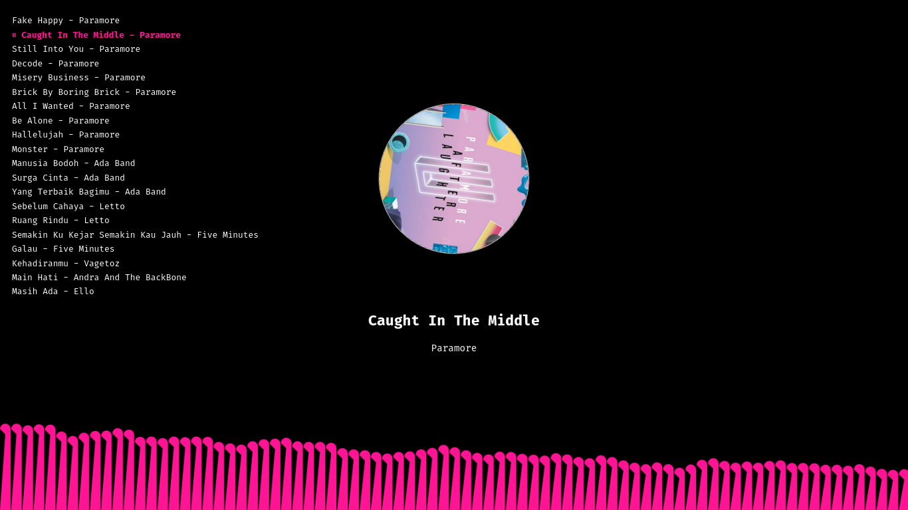

# DonyDaily Music Player

A simple web-based music player with animated visualizer and rotating album art.

## 📁 Folder Structure

```
music-player/
├── index.html
├── style.css
├── script.js
├── audio/
│   └── (your audio files)
├── images/
    └── (your album art images)
```

## 🚀 How to Use

1. Place your MP3 files in the `audio/` folder.
2. Place album art images in the `images/` folder.
3. Open `index.html` in your browser.

## ✅ Features

- Playlist display with clickable tracks
- Animated visualizer using `<canvas>`
- Rotating album art during playback
- Light/Dark mode support

## 📸 Screenshot

